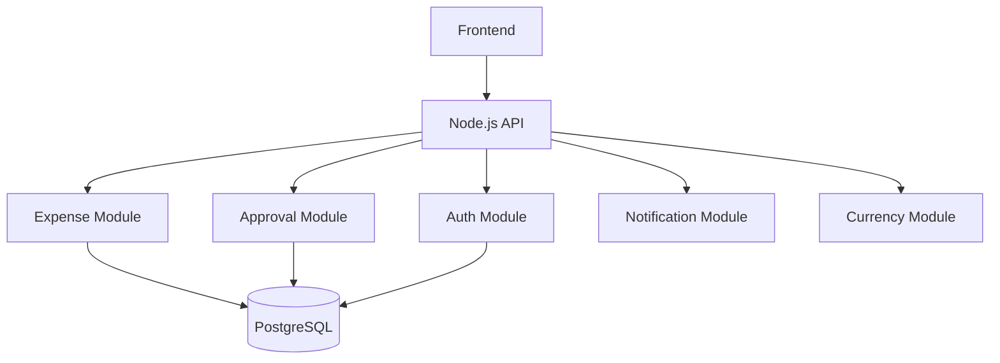
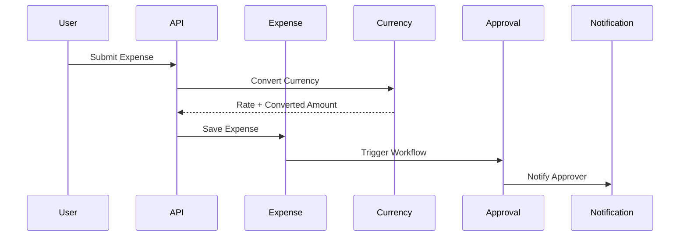

# 🚀 Smart Reimbursement Management System (Backend)

<p align="center">
  
  
  
  
  
</p>

---

# 🧩 Problem Statement

Organizations face inefficiencies in reimbursement systems due to:

* Manual approval workflows
* Lack of structured approval hierarchy
* No dynamic business rules
* Poor tracking of approval lifecycle
* Multi-currency inconsistencies
* Risk of duplicate or fraudulent expenses

---

# 🚀 Solution Overview

A **scalable Node.js backend system** that:

* Automates expense submission & approval workflows
* Implements **dynamic rule engine (JSON-based)**
* Supports **multi-currency normalization**
* Uses **OCR for receipt processing**
* Detects **duplicate expenses**
* Implements **SLA-based approval logic**
* Integrates **real-time currency conversion APIs**
* Secures APIs using **OAuth + JWT**

---

# 🏆 Unique Selling Points

* 🧠 Dynamic Rule Engine
* 🔄 Multi-Level Approval Workflow
* ⏱️ SLA Automation
* 🔍 Duplicate Detection
* 📸 OCR Integration
* 🌍 Multi-Currency Handling with Live Conversion

---

# 🏗️ Architecture

## 🔥 Approach: Modular Monolith (Microservice-Ready)

> Built as a modular monolith with clear boundaries, allowing future migration to microservices.

---

## 📦 Folder Structure (Node.js)

```text
src/
 ├── modules/
 │    ├── auth/
 │    ├── expense/
 │    ├── approval/
 │    ├── notification/
 │    ├── currency/
 │
 ├── middleware/
 ├── config/
 ├── utils/
 └── app.js
```

---

## 🔗 High-Level Architecture



---

## 🔄 Workflow Diagram



---

# 🔄 System Flow

1. User logs in via OAuth
2. JWT issued
3. Expense submitted
4. OCR extracts receipt data
5. Currency conversion applied
6. Duplicate detection
7. Rule engine creates workflow
8. Approval process starts
9. SLA rules applied
10. Notifications triggered
11. Final decision

---

# 🌍 Currency Conversion Service

## 💡 Purpose

* Accept expenses in any currency
* Convert to company base currency
* Store original + converted values

---

## 🔗 API Example

```http
GET /api/currency/convert?from=USD&to=INR&amount=100
```

---

## ✅ Response

```json
{
  "from": "USD",
  "to": "INR",
  "amount": 100,
  "converted_amount": 8300,
  "exchange_rate": 83
}
```

---

## ⚙️ Node.js Service

```js
const axios = require("axios");

const convertCurrency = async (from, to, amount) => {
  const res = await axios.get(`https://api.exchangerate-api.com/v4/latest/${from}`);
  const rate = res.data.rates[to];

  return {
    convertedAmount: amount * rate,
    rate
  };
};
```

---

# 🗄️ Database Design (PostgreSQL)

## ⚙️ Strategy

* Hybrid ID:

  * `BIGINT` → internal
  * `UUID` → external
* Partitioned tables
* Indexed queries

---

## 🔥 Dual ID Pattern

```sql
id BIGSERIAL PRIMARY KEY,
public_id UUID UNIQUE NOT NULL
```

---

## 📊 Expenses Table

```sql
CREATE TABLE expenses (
  id BIGSERIAL,
  public_id UUID UNIQUE,
  user_id BIGINT,

  amount_original DECIMAL,
  currency_original VARCHAR,

  amount_converted DECIMAL,
  currency_company VARCHAR,
  exchange_rate DECIMAL,

  category VARCHAR,
  status VARCHAR,
  created_at TIMESTAMP
);
```

---

# 🔐 Authentication

* OAuth 2.0 (Google Login)
* JWT (RS256)
* RBAC middleware

---

# ⚙️ API Design

### Create Expense

```http
POST /api/expenses
```

---

### Get Expenses

```http
GET /api/expenses?page=1&limit=10&status=APPROVED
```

---

### Approve Expense

```http
POST /api/approvals/:id/approve
```

---

# ⚡ Scalability

* Stateless Node.js backend
* Modular architecture
* DB partitioning
* Ready for horizontal scaling

---

# 🛡️ Error Handling

```json
{
  "success": false,
  "error": {
    "code": "ERROR_CODE",
    "message": "Error message"
  }
}
```

---

# 🧠 Key Design Decisions

* Modular Monolith → simplicity + scalability
* Hybrid IDs → performance + security
* JSONB Rules → flexible workflows
* Currency API integration → real-world system design

---

# 🎯 Final Outcome

A **production-ready Node.js backend system** demonstrating:

* Scalable system design
* Real-world financial workflows
* Clean architecture
* Enterprise-level thinking

---

<p align="center">
  💡 Built for real-world scalability and system design excellence
</p>
